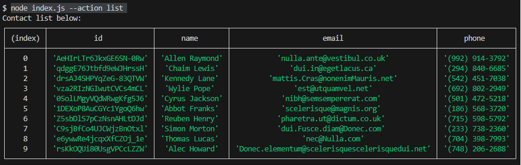
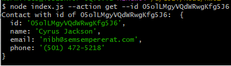
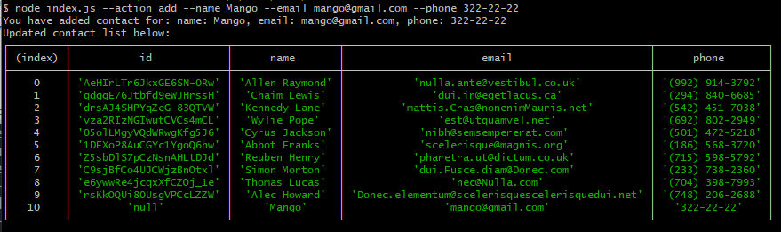
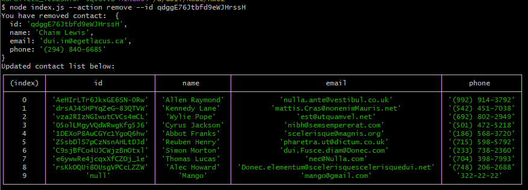

# Commands:

## We get and output the entire contact list as a table (console.table)

```
node index.js --action list
```



## We get contact by id

```
node index.js --action get --id 05olLMgyVQdWRwgKfg5J6
```



## Add contact

```
node index.js --action add --name Mango --email mango@gmail.com --phone 322-22-22
```



## We delete the contact

```
node index.js --action remove --id qdggE76Jtbfd9eWJHrssH
```


